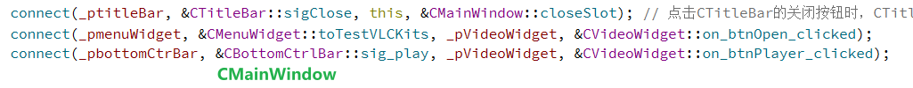
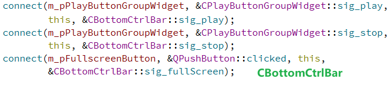
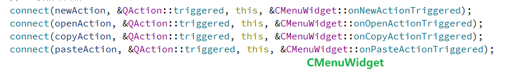
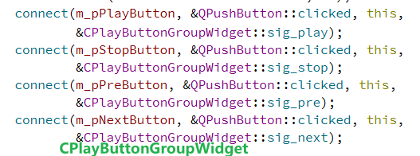

# winId ( )

---------------

`winId()` 返回一个窗口的 **平台原生窗口句柄（Window Handle）**。


### `winId()` 的作用


每个在操作系统中显示的窗口（或控件）都有一个唯一的、由操作系统分配的标识符，这个标识符就是 **窗口句柄**。在不同的操作系统上，这个句柄的类型也不同：

-   在 **Windows** 上，窗口句柄被称为 `HWND`。
-   在 **Linux** (X11) 上，窗口句柄被称为 `Window`。
-   在 **macOS** 上，窗口句柄是 `NSView*` 或 `NSWindow*`。

`winId()` 函数的作用就是将 Qt 控件（例如 `QWidget` 或 `videoWidget`）这个高级、跨平台的抽象，转换为底层操作系统能够识别的窗口句柄。


### 为什么需要 `winId()`？


在许多情况下，你需要与一些 **非 Qt 的、依赖于操作系统底层 API 的库** 进行交互。这些库通常要求你提供一个窗口句柄，以便它们知道应该在哪里绘制内容。

在你的 VLC 播放器项目中，`winId()` 就扮演了这个关键角色：

```C++
libvlc_media_player_set_hwnd(_pmediaPlayer, (void*)ui->videoWidget->winId());
```

-   `libvlc_media_player_set_hwnd()` 是 VLC 库提供的一个函数，它需要一个窗口句柄来指定视频的显示区域。
-   `ui->videoWidget` 是你在 Qt 中创建的一个控件。
-   `ui->videoWidget->winId()` 就是将这个 Qt 控件的实例转换为 Windows 的 `HWND` 或 Linux 的 `Window`。
-   `_pmediaPlayer` 拿到了这个句柄后，就知道应该将视频流的画面渲染到 `videoWidget` 这个区域内。

**简单来说，`winId()` 是 Qt 和底层库（比如 VLC、FFmpeg、DirectX 或 OpenGL 等）之间沟通的桥梁。** 它使得你在 Qt 中创建的控件可以被外部库识别并用于绘制，从而实现各种高级功能，如视频播放、3D 渲染等。


# 程序异常退出

在debug文件夹里存入 libvlc.dll、libvlccore.dll 以及 plugins文件夹


# 两阶段构造

将一个对象的构造和初始化分开; 先创建一个对象, 调用它的构造函数; 再调用它的自定义的初始化函数


**阶段一：构造（Construction）**

-   **目的**：只负责初始化对象的内存和最基本的、不会失败的成员变量。
-   **特点**：这一阶段的代码应该非常简单，不涉及任何可能抛出异常或失败的操作（如文件I/O、网络连接、内存分配失败等）。通常在类的构造函数中完成。

**阶段二：初始化（Initialization）**

-   **目的**：执行所有可能失败或需要更多配置的复杂操作。
-   **特点**：这一阶段的代码通常在一个单独的 `init()` 或 `initialize()` 公共成员函数中完成。这个函数通常返回一个布尔值或错误代码，以告知调用者初始化是否成功。

### 好处:

1.  **分离职责（Separation of Concerns）**：
    -   构造函数的职责是创建对象，而不是处理复杂的业务逻辑。将复杂的、可能失败的初始化逻辑从构造函数中分离出来，使得构造函数的职责更单一、更清晰。
    -   这符合 **单一职责原则** (Single Responsibility Principle)，使代码更容易理解和维护。
2.  **错误处理的灵活性（Flexible Error Handling）**：
    -   C++的构造函数不能直接返回错误代码。虽然可以通过抛出异常来报告失败，但异常处理在某些场景下（如嵌入式系统或某些C风格API）可能并不适用，或者会增加代码的复杂性。
    -   通过 `init()` 函数返回 `bool` 或 `int` 错误码，可以为调用者提供更灵活、更明确的错误处理方式。调用者可以根据返回值决定是继续执行还是采取其他措施（如退出程序、显示错误信息）。
3.  **安全性（Safety）**：
    -   当一个对象构造失败时，它的析构函数可能不会被调用，这可能导致资源泄露。
    -   两阶段构造通过确保构造函数只执行安全操作，然后由 `init()` 函数来执行可能失败的操作。如果 `init()` 失败，你可以在 `main` 函数或调用处进行判断，并安全地处理，而不是在对象构造时就面临不完整的对象状态。
4.  **避免在基类构造函数中调用虚函数（Avoid virtual function calls in constructors）**：
    -   在C++中，不应该在基类的构造函数中调用虚函数，因为此时派生类部分的对象尚未构造完成，调用虚函数会引发不可预测的行为。
    -   如果你的初始化逻辑需要调用虚函数，那么将其放在 `init()` 函数中是更安全的选择，因为此时整个对象（包括派生类部分）已经完全构造。


1.   拷贝了VLCKits.h .cpp
2.   **修改了CMainWindows.h说明**:
     1.  因为要使用 `QWidget` 作为视频播放区域，所以需要包含 `<QWidget>` 头文件。
     2.  我们声明一个新的私有槽 `onPlay()`，它将连接到底部控制栏的播放按钮信号。
     3.  添加 `_pVideoWidget` 成员变量，它将作为VLC渲染视频的画布。

3.   **修改了CMainWindows.cpp说明**:
     **连接信号**: 在构造函数中，我们将 `_pbottomCtrBar` 的 `sig_play` 信号连接到 `CMainWindow` 新创建的 `onPlay` 槽。这样，点击播放按钮时，就会执行我们自己的逻辑，而不是直接去调用 `VLCKits`。

     **实现 `onPlay`**: 这个函数几乎是 `VLCWidget` 中 `on_btnOpen_clicked` 的翻版。它弹出文件对话框，然后调用 `_pVLCKits->play()`，最关键的是将 `_pVideoWidget->winId()` 作为参数传给VLC，告诉它在哪里绘图。

     **UI初始化**: 在 `initUI` 中，我们创建了 `_pVideoWidget` 实例，并调用了 `_pVLCKits->initVLC()` 进行初始化。然后，我们按照您指定的顺序——`_ptitleBar`, `_pmenuWidget`, `_pVideoWidget`, `_pbottomCtrBar`——将它们依次添加到垂直布局 `pvLayout` 中。设置拉伸因子 `setStretchFactor` 可以确保在窗口缩放时，视频区域会自动填充可用空间。


# 各种信号和槽










